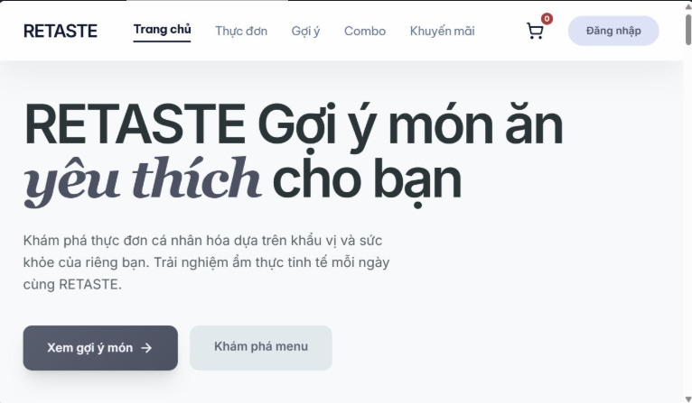

<div align="center">
  <h1>🍽️ RETASTE</h1>
  <p><strong>Food & Beverage Recommendation Platform</strong></p>
  <p>Nền tảng bán hàng đồ ăn & thức uống kèm hệ thống gợi ý thông minh</p>
  <br>
  
  <br><br>
</div>

---

## 📋 Overview | Tổng quan

RETASTE is a full-stack food & beverage e-commerce platform with an intelligent recommendation system, order management, staff management, and delivery service integration (Lalamove).

RETASTE là nền tảng thương mại điện tử đồ ăn & thức uống full-stack với hệ thống gợi ý thông minh, quản lý đơn hàng, nhân viên và tích hợp dịch vụ vận chuyển.

---

## ✨ Features | Tính năng

- **🔐 Authentication** — JWT, Google OAuth, Facebook OAuth (Passport.js)
- **🍕 Product Management** — Menu categories, items, pricing, images
- **🛒 Order System** — Cart, checkout, order tracking, history
- **⭐ Recommendation Engine** — Personalized food & drink suggestions
- **👥 Staff Management** — Role-based access control
- **🚚 Delivery Integration** — Lalamove API integration
- **📊 Admin Dashboard** — Analytics, order management, user management

---

## 🛠️ Tech Stack | Công nghệ

| Layer | Technology |
|-------|-----------|
| **Backend** | Node.js, Express, TypeScript |
| **Frontend** | React 19, Vite, Tailwind CSS |
| **Database** | MySQL (primary), MongoDB (logs & recommendations) |
| **Auth** | Passport.js (JWT, Google OAuth, Facebook OAuth) |
| **Other** | Axios, bcryptjs, Helmet, Lucide React |

---

## 🚀 Getting Started | Bắt đầu

### Prerequisites | Yêu cầu

- Node.js ≥ 18
- MySQL ≥ 8
- MongoDB ≥ 6

### Installation | Cài đặt

**1. Clone the repository**

```bash
git clone https://github.com/hasskinh1-netizen/RETASTE.git
cd RETASTE
```

**2. Backend setup**

```bash
cd server
npm install
cp .env.example .env   # Configure your environment variables
npm run db:init         # Initialize MySQL database
npm run dev             # Start dev server on http://localhost:5000
```

**3. Frontend setup**

```bash
cd client
npm install
npm run dev             # Start dev server on http://localhost:3000
```

---

## 🔧 Environment Variables | Biến môi trường

Create `server/.env` with the following:

```env
MYSQL_HOST=127.0.0.1
MYSQL_USER=root
MYSQL_PASSWORD=your_password
MYSQL_DATABASE=retaste
MONGO_URI=mongodb://127.0.0.1:27017/retaste
JWT_SECRET=your_jwt_secret
GOOGLE_CLIENT_ID=
GOOGLE_CLIENT_SECRET=
FACEBOOK_APP_ID=
FACEBOOK_APP_SECRET=
```

> **⚠️ Never commit secrets to Git.** Use `.env` locally and GitHub Secrets for deployment.

---

## 📁 Project Structure | Cấu trúc

```
RETASTE/
├── client/                  # React + Vite frontend
│   ├── src/                 # Source code
│   ├── public/              # Static assets
│   ├── index.html
│   └── package.json
├── server/                  # Express + TypeScript backend
│   ├── src/                 # Source code
│   ├── docs/                # Documentation & images
│   ├── dist/                # Compiled output
│   └── package.json
├── .gitignore
└── README.md
```

---

## 📜 Available Scripts | Scripts có sẵn

### Server
| Script | Description |
|--------|-------------|
| `npm run dev` | Start dev server with hot reload |
| `npm run build` | Compile TypeScript to JavaScript |
| `npm start` | Start production server |
| `npm run db:init` | Initialize MySQL database |

### Client
| Script | Description |
|--------|-------------|
| `npm run dev` | Start Vite dev server |
| `npm run build` | Build for production |
| `npm run preview` | Preview production build |

---

## 🤝 Contributing | Đóng góp

1. Fork the repository
2. Create a feature branch: `git checkout -b feature/your-feature`
3. Commit changes: `git commit -m 'Add some feature'`
4. Push: `git push origin feature/your-feature`
5. Open a Pull Request

---

## 👥 Team | Nhóm phát triển

**Nhóm 6 — Lớp CS 434 SG**

---

## 📄 License

This project is for educational purposes.
